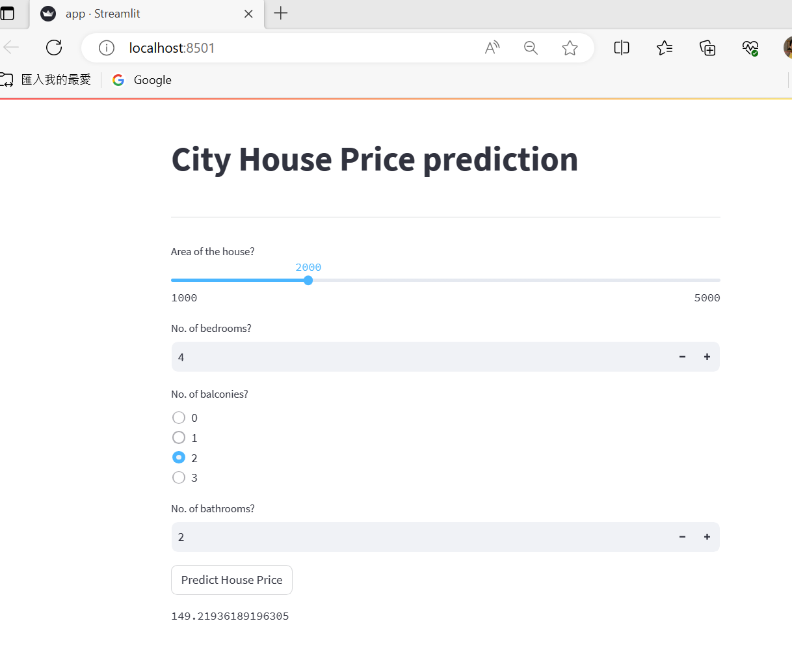

Streamlit is an open source framework (a Python-based library) that helps data engineer build fancy web app with
only a few lines of code. you will in love with it after the first look.

UI preview for the city house price prediction program:

